# Tests du site web de MalyArt

## 1) Inscription

### a) Champ non rempli

Lorsqu'un champ n'est pas rempli (à l'exception du complément de l'adresse) et que l'on veut valider le formulaire, 
le message suivant apparaît :

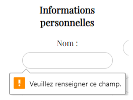

### b) Adresse mail incorrecte

Lorsque l'utilisateur veut créer son compte avec une adresse mail ne respectant pas le format d'une adresse mail (regex utilisée : `^[a-zA-Z0-9._-]+@[a-zA-Z0-9.-]{2,}[.][a-zA-Z]{2,4}$`), 
un pop-up d'erreur apparaît et l'utilisateur doit saisir une adresse mail valide :

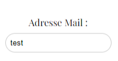

### c) Numéro de téléphone incorrect

Lorsque l'utilisateur veut créer son compte avec une adresse mail ne respectant pas le bon format (regex utilisée : `^(?:\+33|0)[1-9]([0-9]{1,8})$`),
un pop-up d'erreur apparaît et l'utilisateur doit saisir un numéro de téléphone valide :

image::tel_invalide.png[téléphone invalide]

### d) Format de mot de passe invalide

Lorsque l'utilisateur veut créer son compte avec un mot de passe ne respectant pas le bon format (8 caractères minimum, dont une majuscule, une minuscule et un chiffre),
un pop-up d'erreur apparaît et l'utilisateur doit saisir un mot de passe valide :

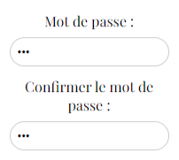

### e) Mot de passe non correspondant

Lorsque l'utilisateur saisit un mot de passe différent lors de la confirmation du mot de passe, un pop-up d'erreur apparaît et l'utilisateur doit saisir le même mot de passe que celui qu'il a donné en premier lieu :

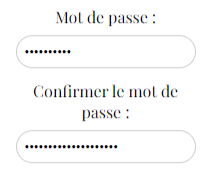

### f) Mail, téléphone ou nom d'utilisateur déjà existant

Lorsque l'utilisateur essaie de créer un compte en utilisant une adresse e-mail, un numéro de téléphone ou un nom d'utilisateur déjà associé à un autre compte, un pop-up s'affiche. 
L'utilisateur est alors invité à remplacer le champ concerné par une valeur non encore utilisée. (L'affichage du pop-up s'adapte en fonction du champ à remplacer)

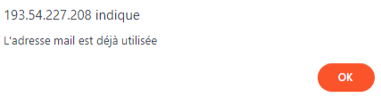

### g) Inscription validée

Lorsqu'aucun problème n'est rencontré, le pop-up suivant d'affiche et l'utilisateur est alors redirigé vers la page de connexion au site.

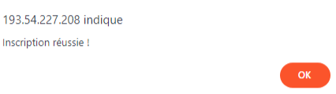

## 2) Connexion

Lorsque l'utilisateur souhaite se connecter mais oublie de renseigner son nom d'utilisateur ou son mot de passe, le même type d'erreur apparaît que lorsqu'un champ n'est pas rempli lors de l'inscription. L'utilisateur 
ne peut donc pas se connecter.

Lorsque l'utilisateur n'utlise pas le bon nom d'utilisateur et/ou mot de passe, le pop-up suivant apparaît et l'utilisateur est invité à réessayer de se connecter :

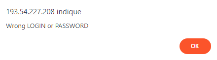

Si l'utilisateur rentre les bons identifiants, il sera redirigé vers l'accueil s'il arrive depuis celui-ci. S'il est redirigé vers la page de connexion après avoir cliqué sur panier, il reviendra sur cette page après 
s'être connecté. Le fonctionnement est semblable si l'utilisateur arrive sur la page de connexion après avoir cliqué sur le bouton compte.
En cochant le bouton "se souvenir de moi", le nom d'utilisateur est sauvegardé pour la prochaine connexion : 

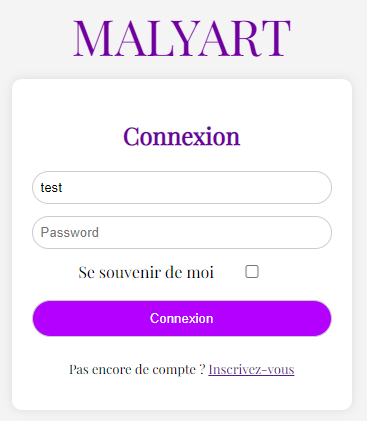

## 3) Modification des informations du compte

Si l'utilisateur tente de valider le formulaire permettant de modifier les informations de son compte sans avoir rempli tous les champs obligatoires (tous les champs sont obligatoires sauf le complément de l'adresse),
le même message indiquant qu'un champ n'est pas rempli apparaîtra.

Si l'adresse mail, le nom d'utilisateur ou le numéro de téléphone est modifié et que la nouvelle valeur est déjà utilisée pour un autre compte, le pop-up d'erreur suivant apparaîtra et l'utilisateur devra remplir le champ
concerné avec une nouvelle valeur :

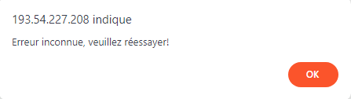

## 4) Ajout/Modification d'un produit

Pour ajouter un produit, une composition ou un produit à une composition, l'administrateur clique sur le bouton correspondant dans le header puis remplis le formulaire avec les informations nécessaires. Tous les champs
doivent être remplis pour pouvoir valider l'ajout.

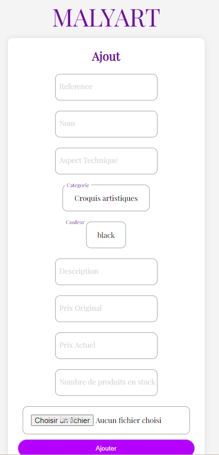

Après avoir cliqué sur le bouton "modifier" sur la page de détails d'un article, l'administrateur peut modifier les informations d'un article. Tous les champs doivent être remplis. Mettre la quantité d'un produit à 0 
l'enlève du site. 

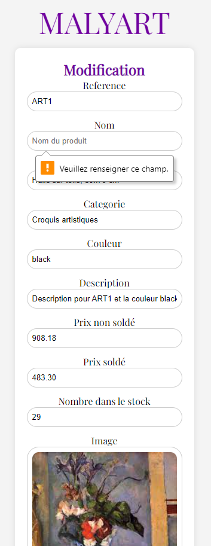

## 5) Laisser un avis

Un utilisateur peut laisser un avis sur un produit une fois celui-ci livré. Sinon, le bouton de validation ne fonctionne pas. Un administrateur peut cependant laisser un commentaire pour répondre à un avis à tout moment.

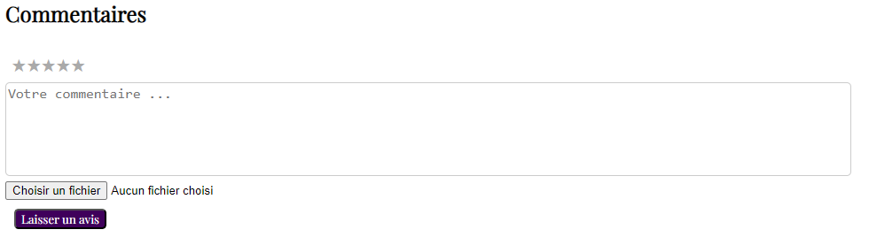

## 6) Supprimer un avis

Pour supprimer un avis, l'administrateur clique sur supprimer sous l'avis correspondant. Celui-ci n'apparaît plus par la suite sur le site.

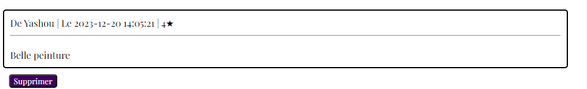

## 7) Payer sa commande

Une fois la commande confirmée, l'utilisateur doit choisir son adresse de livraison. S'il veut en choisir une nouvelle, il doit sélectionner "ajouter une nouvelle adresse" dans le menu déroulant puis remplir les champs. 
Seul le champ "complément" ne doit pas obligatoirement être remplis. 

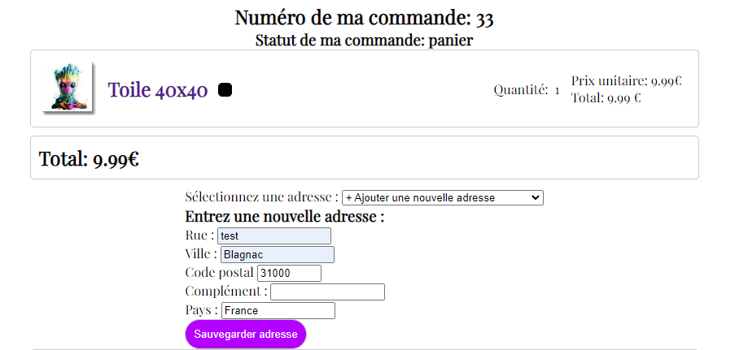

L'utilisateur doit ensuite remplir les champs de ses informations bancaires ou de son compte PayPal suivant le moyen de paiement selectionné. Dans les deux cas, tous les champs doivent être remplis. Les formats doivent tous être respectés (un numéro de carte est composé de 16 chiffres, un code de sécurité/cryptogramme de 3 chiffres...) sinon un message d'erreur de ce type apparaît :

image::erreur_paiement.png[Erreur paiement]

