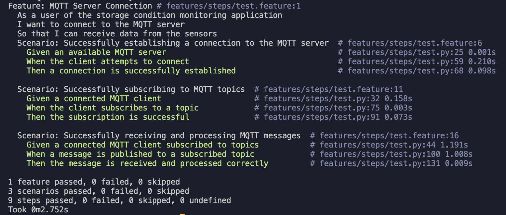
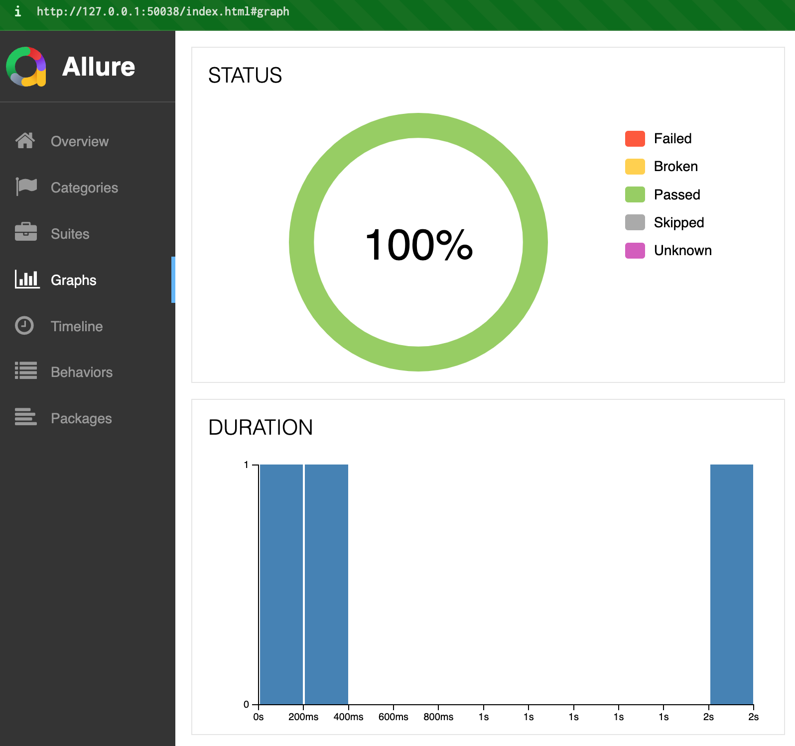
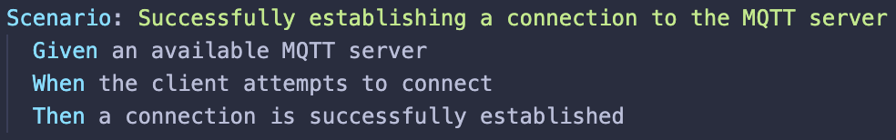
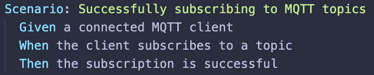
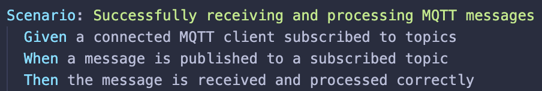
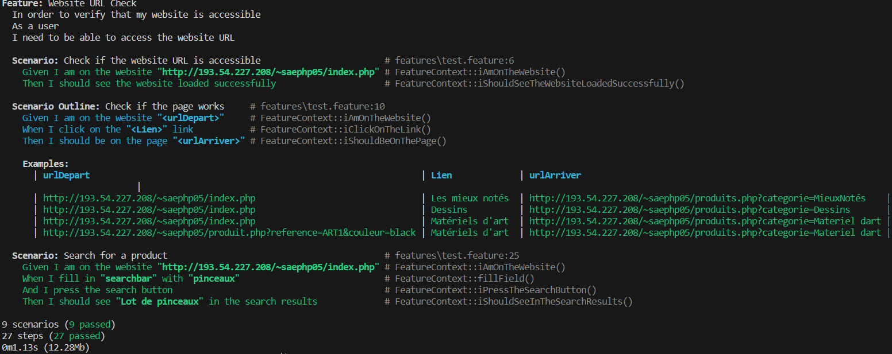
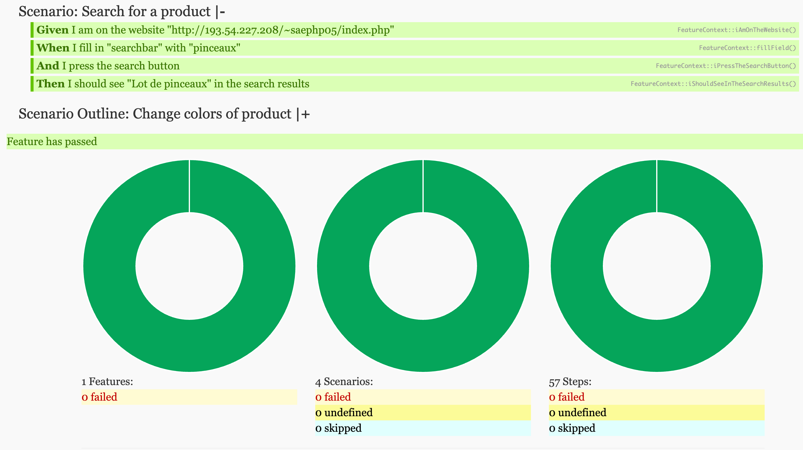
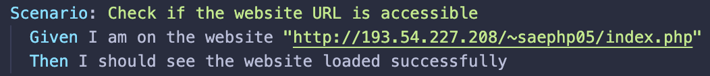
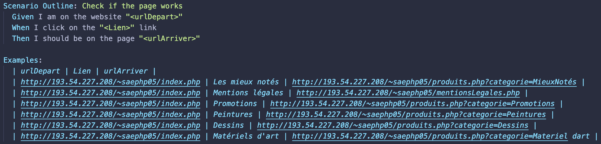

= Documentation Tests
:toc: macro
:toc-title: Table des matières
:toclevels: 3

:hide-uri-scheme:   

== Introduction

Bienvenue dans la documentation utilisateur destinée à guider l'utilisation et la compréhension des tests en Python, en PHP et en Java développés pour le projet.

toc::[]

== Tests en Python

=== Prérequis

Avant de commencer, assurez-vous d'avoir installé les outils et librairies nécessaires. Vous aurez besoin de :

* Python (version 3.x recommandée)
* Bibliothèques Python : paho-mqtt, PyYAML, behave via la commande :

[source,python]
----
pip install paho-mqtt PyYAML behave
----

et autres dépendances spécifiques au projet https://github.com/IUT-Blagnac/sae-3-01-devapp-Equipe-5/blob/master/IOT/PYTHON/README.adoc[Lien vers la documentation générale python]

=== Exécution des Tests

Afin d'exécuter les tests, placez-vous dans le dossier `/IOT/PYTHON` grâce à la commande :

[source,python]
----
cd IOT/PYTHON
----

Puis, lancez la commande suivante :

[source,terminal]
----
behave
----

WARNING: Il est obligatoire d'être connecté sur un réseau externe à l'IUT et exécuter le test sur un système d'exploitation autre que Windows.

Cela devrait donner le rendu suivant :

=== Affichage des résultats

Il est possible d'afficher les résultats des tests dans un fichier HTML pour une meilleure lisibilité. Pour cela, il suffit d'exécuter la commande suivante (dans le dossier `/IOT/PYTHON`) :

[source,terminal]
----
allure serve reports
----

Cela ouvrira une page web dans votre navigateur par défaut avec les résultats des tests : 

=== Structure des Tests

Le premier test consiste à vérifier la capacité du client MQTT à établir une connexion avec le serveur MQTT.

[source,python]
----
@given('an available MQTT server')
def step_impl(context):
    context.server_url = "chirpstack.iut-blagnac.fr"  
    context.server_port = 1883
    context.client = mqtt.Client()
    context.client.connected_flag = False 
----

[source,python]
----
@when('the client attempts to connect')
def step_impl(context):
    context.client.on_connect = on_connect
    try:
        context.client.connect(context.server_url, context.server_port, 60)
        context.client.loop_start()  
    except Exception as e:
        context.connection_exception = e
----

[source,python]
----
@then('a connection is successfully established')
def step_impl(context):
    context.client.loop_stop()
    if hasattr(context, 'connection_exception'):
        raise context.connection_exception
    assert context.client.connected_flag == True
----

Le deuxième test s'attache à valider que le client MQTT, une fois connecté, peut s'abonner à des topics spécifiques.

[source,python]
----
@given('a connected MQTT client')
def step_impl(context):
    context.client = mqtt.Client()
    context.client.on_connect = on_connect
    context.client.connected_flag = False
    context.client.subscribed_flag = False
    context.client.connect("chirpstack.iut-blagnac.fr", 1883, 60)
    context.client.loop_start()
    while not context.client.connected_flag:
        pass  # Wait for connection
----

[source,python]
----
@when('the client subscribes to a topic')
def step_impl(context):

    with open("configuration.yaml", "r") as file:
        config = yaml.safe_load(file)
 
    context.client.on_subscribe = on_subscribe
    for topic in config["topics"]:
        try:
            context.client.subscribe(topic)
            print("~ Subscribed to " + topic)
            context.client.subscribed_flag = True
        except Exception as e:
            print("~ Failed to subscribe to {}: {}".format(topic, str(e)))
            context.client.subscribed_flag = False
----

[source,python]
----
@then('the subscription is successful')
def step_impl(context):
    assert context.client.subscribed_flag == True
    context.client.loop_stop()
----

Le troisième test vérifie la capacité du client MQTT à recevoir et à traiter des messages sur les topics auxquels il est abonné (donc que le message est bien récupérer sur le fichier CSV). 

[source,python]
----
@given('a connected MQTT client subscribed to topics')
def step_impl(context):
    with open("configuration.yaml", "r") as file:
        config = yaml.safe_load(file)
    context.client = mqtt.Client()
    context.client.on_connect = on_connect
    context.client.connect(config["url"], config["port"], config["keepalive"])
    context.client.loop_start()
    while not hasattr(context.client, 'connected_flag') or not context.client.connected_flag:
        time.sleep(0.1)  # Wait for connection
    for topic in config["topics"]:
        context.client.subscribe(topic)
    time.sleep(1)  # Wait for subscription
----

[source,python]
----
@when('a message is published to a subscribed topic')
def step_impl(context):
    with open("configuration.yaml", "r") as file:
        config = yaml.safe_load(file)

    test_topic = "AM107/by-room/E208/data"
    test_message_data = {
        "temperature": 21, 
        "humidity": 59,
        "co2": 1371,
        "activity": 0,
        "tvoc": 391,
        "illumination": 2,
        "infrared": 2,
        "infrared_and_visible": 5,
        "pressure": 993.3
    }
    test_message_info = {
        "deviceName": "AM107-TestDevice",
        "devEUI": "00a1b2c3d4e5f678",
        "room": "B106",
        "floor": 2,
        "Building": "E"
    }
    test_message = [test_message_data, test_message_info]
    thread = threading.Thread(target=publish_test_message, args=(context.client, test_topic, test_message))
    thread.start()
    thread.join()
    time.sleep(1)  # Permettre le traitement du message
----

[source,python]
----
@then('the message is received and processed correctly')
def step_impl(context):
    with open("configuration.yaml", "r") as file:
        config = yaml.safe_load(file)
    expected_data = {
        "temperature": 21, 
        "humidity": 59,
        "co2": 1371,
        "activity": 0,
        "tvoc": 391,
        "illumination": 2,
        "infrared": 2,
        "infrared_and_visible": 5,
        "pressure": 993.3
    }
    with open(config["dataFile"], mode='r') as csvfile:
        csv_reader = csv.DictReader(csvfile)
        for row in csv_reader:
            if all(float(row[key]) == value for key, value in expected_data.items()):
                break
        else:
            assert False, "Les données attendues ne sont pas présentes dans le CSV"
----

== Tests en PHP

=== Prérequis

Afin de pouvoir exécuter les tests en PHP, il est nécessaire d'avoir installé les outils suivants :

* PHP (8.* recommandé)
* Behat (https://docs.behat.org/en/latest/quick_start.html#installation[Installation Behat])

=== Exécution des Tests

Afin d'exécuter les tests, placez-vous dans le dossier `/Site_eCommerce` grâce à la commande :

[source,terminal]
----
cd Site_eCommerce
----

Puis, lancez la commande suivante :

[source,terminal]
----
vendor/bin/behat
----

Cela devrait donner le rendu suivant :

WARNING: Il se peut que la commande vendor/bin/behat ne retourne rien. Dans ce cas, il vous faudra supprimer le dossier vendor et exécuter la commande suivante :

[source,terminal]
----
composer install
----

=== Affichage des résultats

Il est possible d'afficher les résultats des tests dans un fichier HTML pour une meilleure lisibilité. Pour cela, il suffit d'ouvrir le fichier `/Site_eCommerce/reports/index.html` dans votre navigateur :

il suffit d'exécuter la commande suivante (dans le dossier `/Site_eCommerce`) :

[source,terminal]
----
vendor/bin/behat --format html --out ./reports 
----

=== Structure des Tests

Le premier test consiste à vérifier que le site web est accessible et que la page a été chargée avec succès.

[source,php]
----
    /**
     * @Given I am on the website :url
     */
    public function iAmOnTheWebsite($url)
    {
        $this->visit($url);
    }
----

[source,php]
----
    /**
     * @Then I should see the website loaded successfully
     */
    public function iShouldSeeTheWebsiteLoadedSuccessfully()
    {
        $statusCode = $this->getSession()->getStatusCode();
        if ($statusCode != 200) {
            throw new Exception("Website did not load successfully. Status code: $statusCode");
        }
    }
----

Le deuxième test consiste à vérifier que le fonctionnement de plusieurs liens en utilisant un ensemble d'exemples pour spécifier différentes URLs de départ, textes de liens, et URLs d'arrivée attendues après le clic

[source,php]
----

----

[source,php]
----

----

[source,php]
----

----