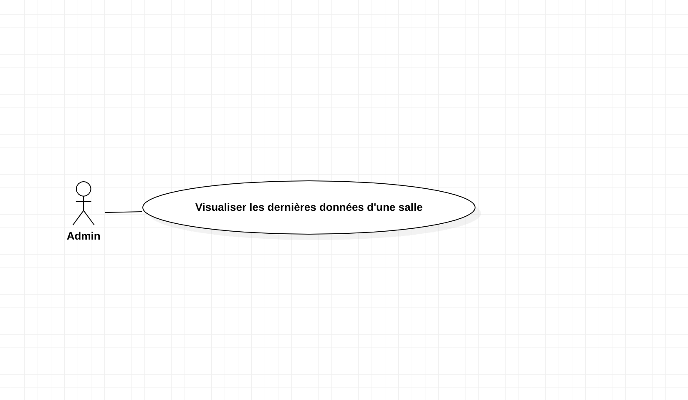
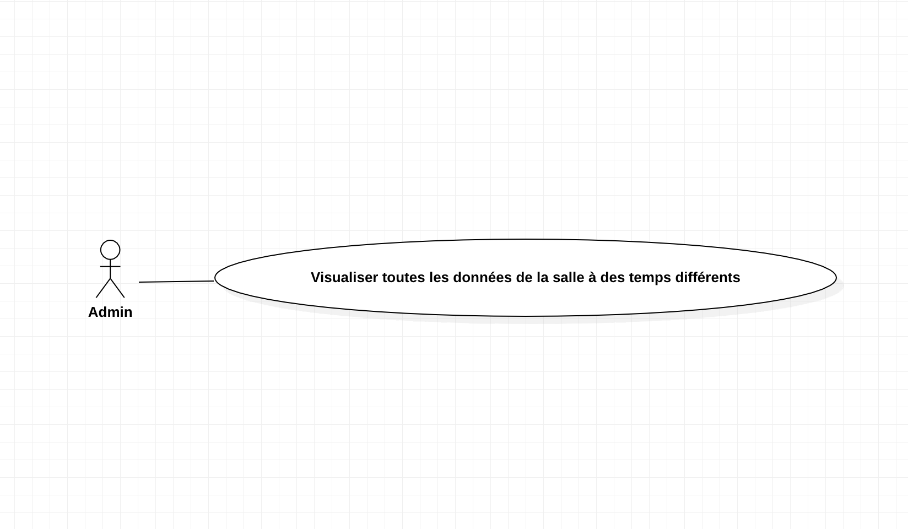
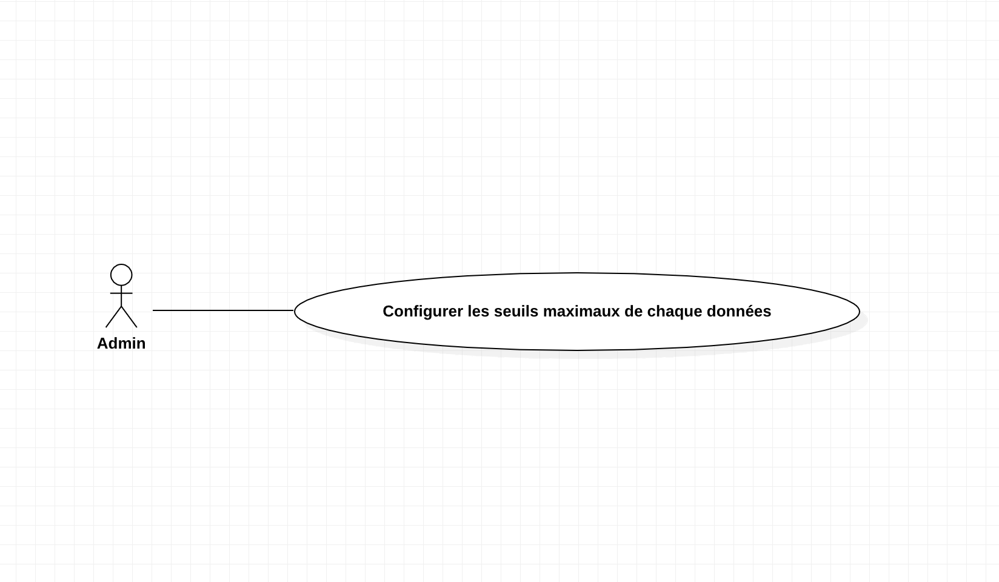
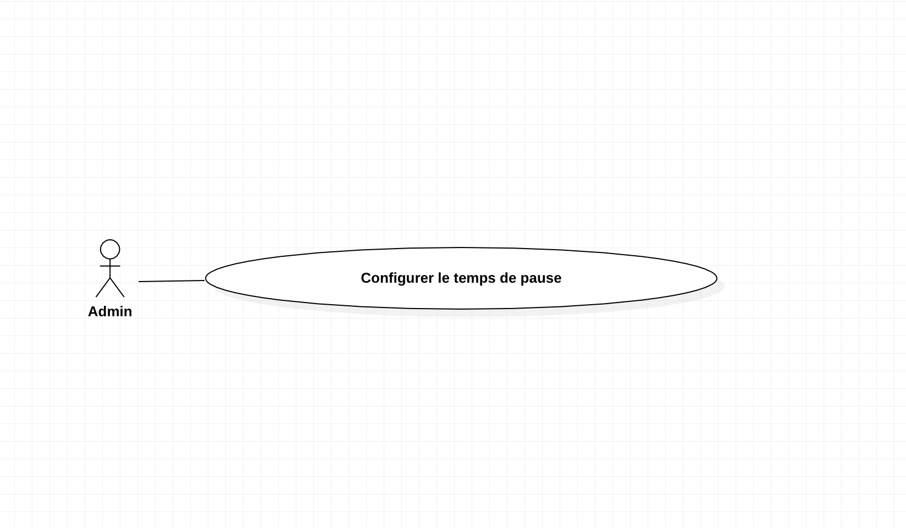

= SAÉ 3.01 2023-2024 - Documentation technique Java - Équipe 5
:toc:
:toc-title: Table des matières
:sectnums: 
:sectnumlevels: 4

== Présentation rapide de l’application
L’entreprise MalyArt souhaite suivre en direct l’environnement dans ses différents entrepôts de stockage. Plusieurs capteurs ont été installés permettant la récupération de données suivantes : Temperature, Humidité, CO2, Activité, Tvoc, Illumination, Infrared, Infrared_et_visibilité et Pression. Grâce à ces derniers, l'entreprise souhaite disposer d’un outil permettant la visualisation de ces données pour s’assurer des bonnes conditions de stockage de ces produits (Peintures, Dessins, Matériels d'art, etc...).

Voici le Use Case global de l'application :

image::./img/use_case_java.png[Use case]

Ainsi, les fonctionnalités de l'application sont les suivantes :

- Visualisation des dernières données d'une salle 
- Visualisation de toutes les données d'une salles
- Configuration des seuils maximaux pour chaque données
- Configuration du temps de pause entre deux relevés de données

== Installation et utilisation de l’application

// Mettre le lien vers le fichier documentation_utilisateur.adoc

L'installation et l'utilisation de l'application sont expliquées dans le fichier https://github.com/IUT-Blagnac/sae-3-01-devapp-Equipe-5/blob/master/IOT/JAVA/Documentation_utilisateur.adoc[documentation utilisateur]

== Structure de l'application

La structure de l’application est répartie en plusieurs packages que voici :
----
├── com.malyart
    └── main
    │   ├── com.malyart.controls
    │   ├── com.malyart.tools
    │   └── com.malyart.views
    │   
    └── resources
        └── com.malyart
----

== Explications des fonctionnalités

=== Visualisation des dernières données d'une salle

Notre client pourra visualiser en temps réel les données suivantes : Temperature, Humidité, CO2, Activité, Tvoc, Illumination, Infrared, Infrared_et_visibilité et Pression. Pour cela, il devra sélectionner une salle dans la liste déroulante et cliquer sur le bouton "Afficher". Les données de la salle sélectionnée s'afficheront dans une nouvelle fenêtre.

- Partie du Use Case conforme :

- Classes impliquées à l’implémentation de la fonctionnalité :

*Package ``java.com.malyart.views`` :* +
____
• _SelectController.java_
• _DisplayController.java_
____

*Package ``java.com.malyart.tools`` :* +
____
• _SelectSalle.java_
____

*Package ``resources.com.malyart`` :* +
____
• _select.fxml_
• _display.fxml_
____

=== Visualisation de toutes les données d'une salle

Notre client pourra visualiser toutes les données d'une salle. Pour cela, il devra sélectionner une salle dans la liste déroulante et cliquer sur le bouton "Afficher". Puis ensuite cliquer sur le bouton "All". Les données de la salle sélectionnée s'afficheront dans une nouvelle fenêtre.

- Partie du Use Case conforme :

- Classes impliquées à l’implémentation de la fonctionnalité :

*Package ``java.com.malyart.views`` :* +
____
• _SelectController.java_
• _DisplayController.java_
• _DisplayDataController.java_
____

*Package ``java.com.malyart.tools`` :* +
____
• _SelectSalle.java_
____

*Package ``resources.com.malyart`` :* +
____
• _select.fxml_
• _display.fxml_
• _displayData.fxml_
____

=== Configuration des seuils maximaux pour chaque données

Notre client pourra configurer les seuils maximaux pour chaque données. Pour cela, il devra cliquer sur le bouton "Configuration". Une nouvelle fenêtre s'ouvrira et il pourra modifier les seuils maximaux. Il devra ensuite cliquer sur le bouton "Confirmer" pour enregistrer les modifications.

- Partie du Use Case conforme :

- Classes impliquées à l’implémentation de la fonctionnalité :

*Package ``java.com.malyart.views`` :* +
____
• _ConfigureController.java_
____

*Package ``resources.com.malyart`` :* +
____
• _configure.fxml_
____

=== Configuration du temps de pause entre apres 10 minutes continues de prélevement de données

Notre client pourra configurer le temps de pause entre apres 10 minutes continues de prélevement de données. Pour cela, il devra cliquer sur le bouton "Configuration". Une nouvelle fenêtre s'ouvrira et il pourra modifier le temps de pause. Il devra ensuite cliquer sur le bouton "Confirmer" pour enregistrer les modifications.

- Partie du Use Case conforme :

- Classes impliquées à l’implémentation de la fonctionnalité :

*Package ``java.com.malyart.views`` :* +
____
• _ConfigureController.java_
____

*Package ``resources.com.malyart`` :* +
____
• _configure.fxml_
____

== Explications des choix techniques

=== Choix de l’architecture

Nous avons choisi d'utiliser l'architecture MVC car elle permet de séparer les données de l'application, de l'interface graphique et du contrôleur. Cela permet de faciliter la maintenance et l'évolution de l'application. De plus, cette architecture est très utilisée dans le développement d'applications Java.

=== Choix des outils

Nous avons choisi JavaFX pour la réalisation de l'interface graphique car il permet de créer des interfaces graphiques riches et modernes. De plus, il est très utilisé dans le développement d'applications Java.

