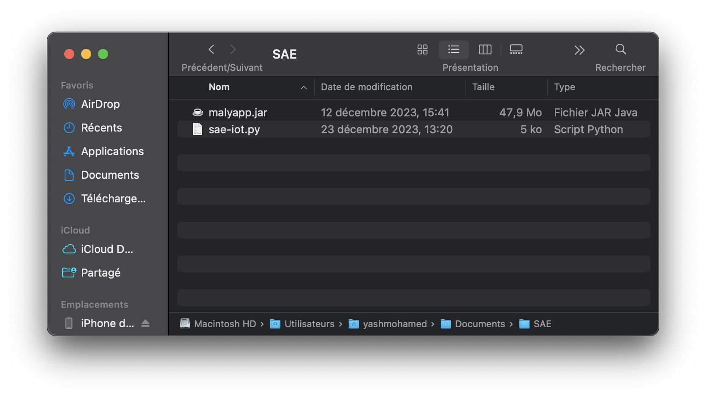

= SAÉ 3.01 2023-2024 - Documentation utilisateur Java - Équipe 5
:toc:
:toc-title: Table des matières
:sectnums: 
:sectnumlevels: 4

== Introduction
Notre application java permet de configurer les données recherchées grâce aux différents capteurs présents dans les entrepôts de stockage de MalyArt qui les utilise pour s'assurer que les conditions de stockage sont optimales pour les oeuves d'art qui y sont entreposées.

L'objectif est que les employés de MalyArt puissent consulter les conditions de stockage facilement.  

== Prérequis
L'application nécessite plusieurs choses qu'il vous faudra installer au préalable : 

- `malyapp.jar` pour lancer l'application (Inclus dans le Git) 
- `Java 17` ou une version ultérieure. (https://www.oracle.com/fr/java/technologies/downloads/)

== Installation
1. Télécharger l'application java à partir du lien suivant : https://github.com/IUT-Blagnac/sae-3-01-devapp-Equipe-5/blob/IOT/IOT/JAVA/malyapp.jar[malyapp.jar]

2. Regrouper l'application dans le même dossier que le programme python.

== Utilisation
Pour lancer l'application, il vous suffit de lancer le fichier malyapp.jar :

- Vous pouvez cliquez directement sur le fichier :

- Sinon avec la ligne de commande suivante dans un terminal (vérifiez que vous êtes dans le répertoire où il y a l'application) :
----
java -jar malyapp.jar
----

