= SAÉ 3.01 2023-2024 - Documentation Python - Équipe 5
:toc:
:toc-title: Table des matières
:sectnums: 
:sectnumlevels: 4

== Introduction
Notre application python permet de récupérer les données envoyées par les différents capteurs présents dans les entrepôts de stockage de MalyArt qui les utilise pour s'assurer que les conditions de stockage sont optimales pour les oeuves d'art qui y sont entreposées.

L'objectif est de pouvoir afficher ces données sur une application JavaFX pour que les employés de MalyArt puissent les consulter facilement.  

== Prérequis

L'application nécessite plusieurs choses qu'il vous faudra installer au préalable : 

- `Python 3` ou une version ultérieure. (https://www.python.org/downloads/)
- `pip` pour installer les dépendances. (Inclus dans Python 3.4 et supérieur) 
- `csv` pour lire les fichiers csv. (Bibliothèque Python)
- `yaml` pour lire les fichiers yaml. (`pip install pyyaml`	)
- `paho.mqtt.client` pour communiquer avec le broker MQTT. (`pip install paho-mqtt`)
- `json` pour lire les fichiers json. (Bibliothèque Python)
- `time` pour gérer le temps. (Bibliothèque Python)
- `signal` pour gérer les signaux. (Bibliothèque Python)

WARNING: L'application ne fonctionne que sur *Linux*.

== Installation
1. Téléchargez le fichier python à partir du lien suivant : https://github.com/IUT-Blagnac/sae-3-01-devapp-Equipe-5/blob/IOT/IOT/PYTHON/sae-iot.py[sae-iot.py]

2. Téléchargez le fichier de configuration à partir du lien suivant : https://github.com/IUT-Blagnac/sae-3-01-devapp-Equipe-5/blob/IOT/IOT/PYTHON/configuration.yaml[configuration.yaml]

3. Regroupez les deux fichiers dans un même dossier.

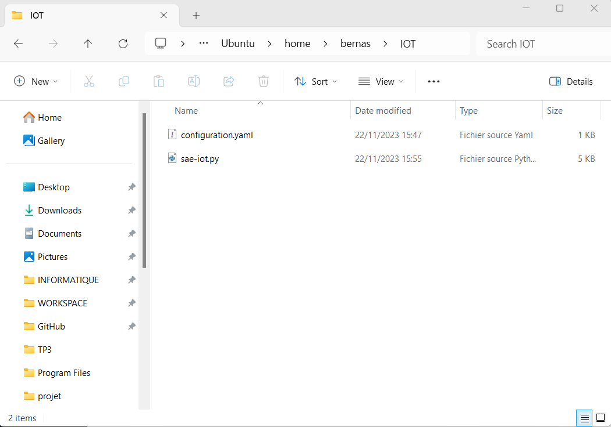

WARNING: Il est important que les noms des fichiers soient respectés.

== Utilisation
Pour utiliser l'application, il vous suffit d'ouvrir un terminal dans le dossier contenant les deux fichiers et de lancer la commande suivante :

[source,shell]
----
python3 sae-iot.py
----

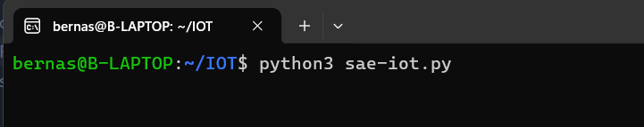

== Explication de la structure du code
Le programme python est divisé en deux parties :
- Le fichier de configuration (configuration.yaml)
- Le fichier principal (sae-iot.py)

=== Le fichier de configuration
Le fichier de configuration est un fichier yaml qui permet de configurer l'application. Il est divisé en plusieurs parties :

==== Le broker
Cette partie permet de configurer le broker MQTT. Il est possible de modifier l'adresse du broker et le port utilisé.

[source,yaml]
----
url: "chirpstack.iut-blagnac.fr"
port: 1883
keepalive: 60
----

==== Les topics
Cette partie permet de configurer les topics MQTT. Il est possible de modifier les topics auxquels l'application va s'abonner.

[source,yaml]
----
topics: ["AM107/by-room/+/data","AM107/by-room/E003/data","AM107/by-room/E006/data"]
----

==== Les fichiers
Cette partie permet de configurer les fichiers csv ou se trouvent les données des capteurs. Il est possible de modifier les fichiers csv utilisés par l'application.

[source,yaml]
----
dataFile: "data.csv"
alertFile: "alert.csv"
----

==== Les données des capteurs à récupérer
Cette partie permet de configurer les données des capteurs à récupérer. Il est possible de modifier les données des capteurs à récupérer.

[source,yaml]
----
selectedData: ["temperature","humidity","co2","activity","tvoc","illumination","infrared","infrared_and_visible","pressure"]
----

==== Les temps d'attente entre chaque écoute 
Cette partie permet de configurer les temps d'attente entre chaque écoute. Il est possible de modifier les temps d'attente entre chaque écoute. (Le temps ou l'application va ecouter les données des capteurs est aussi présent mais il n'est pas possible de le modifier dans l'application)

[source,yaml]
----
rest_duration  : 30
running_time : 10
----

==== Les seuils d'alertes
Cette partie permet de configurer les seuils d'alertes. Il est possible de modifier les seuils d'alertes.

[source,yaml]
----
thresholds:
  temperature : 10
  humidity : 45
  co2 : 10000
  activity : 300
  tvoc : 500
  illumination : 100
  infrared : 100
  infrared_and_visible : 100
  pressure : 1100
----

=== Fonctionnement de l'application python
Notre application python fonctionne de la manière suivante :

==== Récupération des paramètres
L'application récupère les paramètres du fichier de configuration.

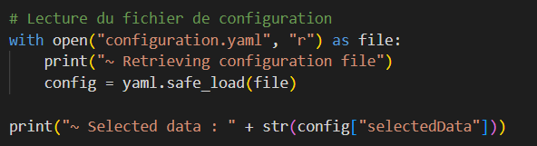

==== Connexion au broker MQTT
L'application se connecte au broker MQTT.
Cela se fait grâce à la fonction `on_connect` qui est appelée lorsque l'application se connecte au broker MQTT.

Dans la même fonction, l'application s'abonne aux topics configurés dans le fichier de configuration.

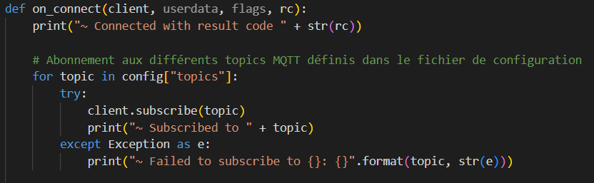

==== Création des fichiers de données
Dans la fonction `on_connect`, l'application crée les fichiers de données configurés dans le fichier de configuration s'ils n'existent pas déjà.

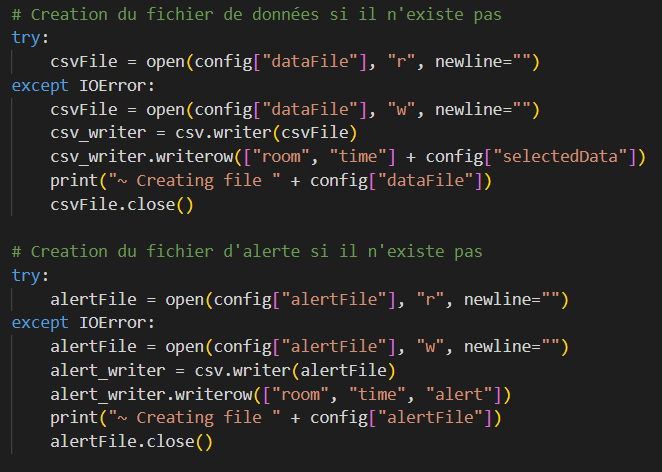

==== Récupération des données
L'application reçoit les données des capteurs grâce à la fonction `on_message` qui est appelée lorsque l'application reçoit un message du broker MQTT.

Dans un premier temps, l'application récupère les données du message et les transforme en dictionnaire json.
Puis elle ne retient que les données des capteurs configurés dans le fichier de configuration. Cela se faite grâce à un dictionnaire crée en compréhension qui ne retient que les données des capteurs configurés.

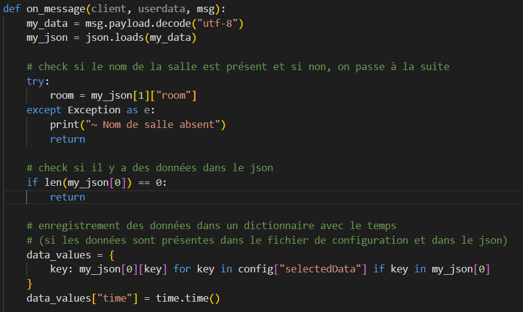

==== Enregistrement des données
L'application enregistre ensuite les données dans le fichier de données configuré dans le fichier de configuration.

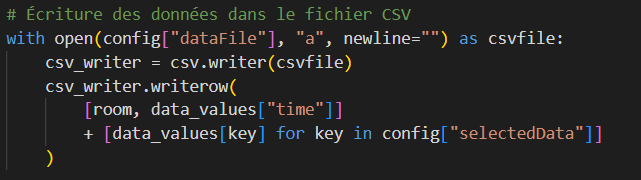

==== Check et enregistrement des alertes
L'application vérifie ensuite si les données reçues sont en dehors des limites configurées dans le fichier de configuration.
Si c'est le cas, elle enregistre une alerte dans le fichier d'alertes.

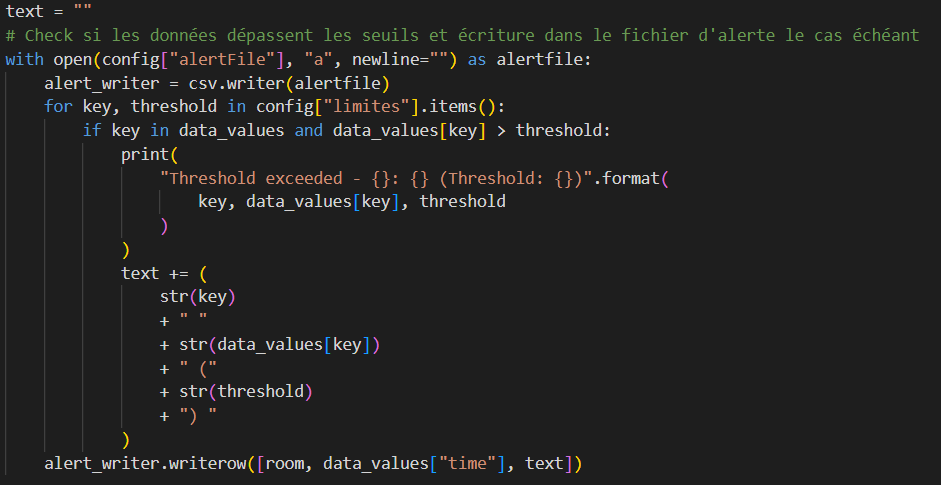

==== Moyenne des données
L'application calcule ensuite la moyenne des données reçues et l'affiche dans la console.

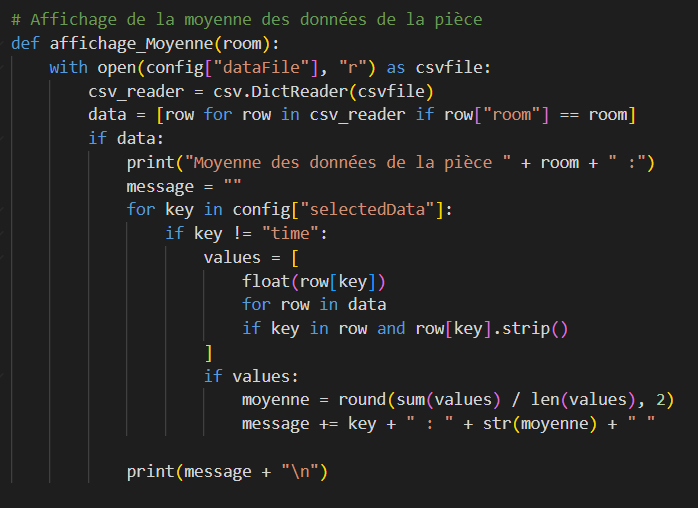

Cette moyenne est calculée en ouvrant le fichier de données, en lisant les données et en calculant la moyenne de chaque type de données pour la pièce. 

==== Fréquence de récupération des données
L'application attend ensuite la durée de pause configurée dans le fichier de configuration avant de récupérer de nouveau les données. Pour cela, nous utilisons la librairie `signal` qui permet de gérer les signaux.

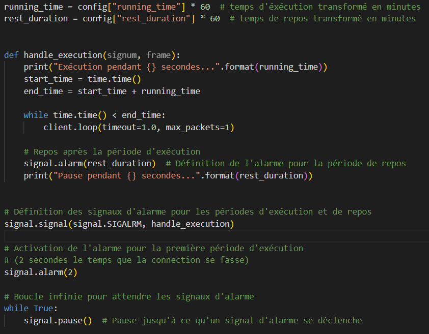

Le fonctionnement est le suivant :

- L'application crée un signal `SIGALRM` qui est appelé lorsque la durée de pause est écoulée, ce signal appelle la fonction `handler`.
- Lors de l'appel de la fonction `handler` (ici `handle_execution`), celle-ci débute l'écoute des données du broker MQTT tant que la durée de récupération des données n'est pas écoulée.
- Lorsque la durée de récupération des données est écoulée, la fonction `handle_execution` lance une nouvelle alarme qui débute le temps de pause.
- Pour l'attente de l'alarme nous avons une boucle infinie qui attend la réception du signal `SIGALRM`.

== Exemple d'utilisation

Pour tester notre application, nous avons utilisé le broker MQTT `chirpstack.iut-blagnac.fr` et le topic `AM107/by-room/+/data`.

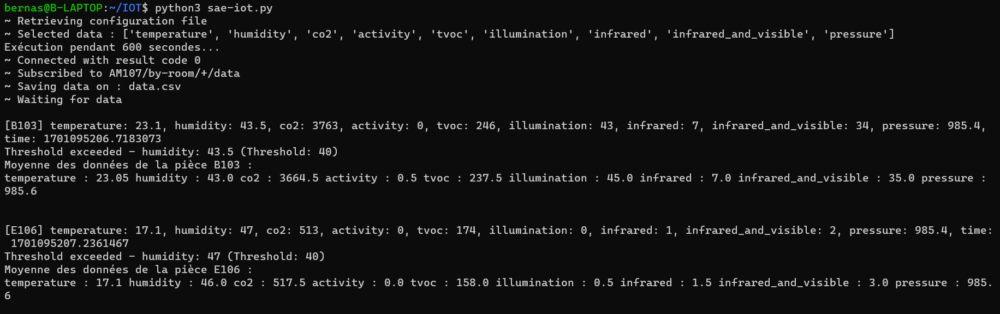

L'application récupère les données du capteur `AM107` et les enregistre dans le fichier `data.csv` et les alertes dans le fichier `alert.csv`.

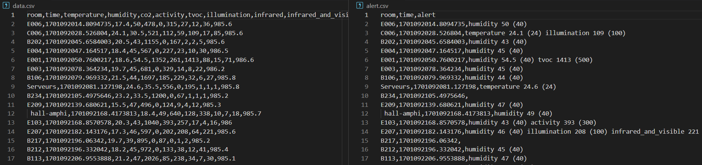

== Tests
Nous allons maintenant tester l'application en utilisant le broker MQTT de l'IUT de Blagnac. 
Pour cela, nous allons utiliser le topic `AM107/by-room/E003/data` qui contient les données du capteur de la salle E003.

=== Test 1 : Lancement de l'application et réception des données normales
Pour ce premier test, nous allons lancer l'application et vérifier que celle-ci reçoit bien les données du capteur de la salle E003.

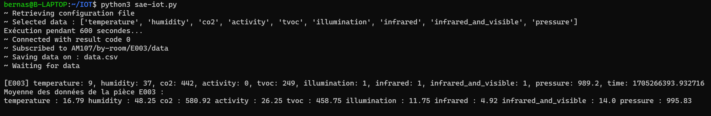

Comme nous pouvons le voir sur l'image ci-dessus, l'application a bien reçu les données du capteur de la salle E003 et les a affichées dans la console.

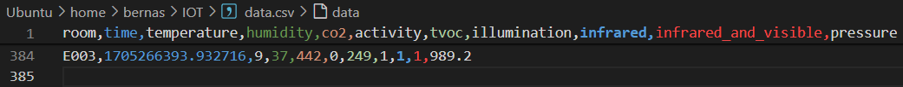

Nous pouvons également voir que les données ont bien été enregistrées dans le fichier csv.

=== Test 2 : Réception des données d'alertes

Pour ce deuxième test, nous allons modifier les seuils d'alertes dans le fichier de configuration pour que l'application reçoive des données d'alertes.

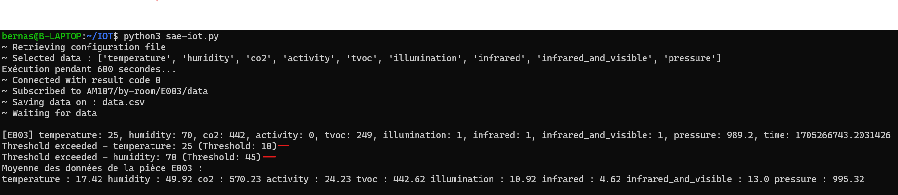

Comme nous pouvons le voir sur l'image ci-dessus, l'application a bien reçu les données d'alertes du capteur de la salle E003 et les a affichées dans la console et en plus nous avons des données d'alertes affichées dans le terminal et dans le fichier csv d'alertes.

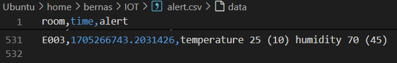

=== Test 3 : Réception des données anormales
Pour le troisième test, nous allons modifier le message reçu par l'application pour que celle-ci reçoive des données anormales.

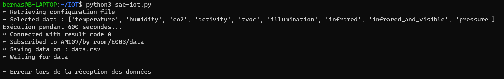

Nous pouvons voir sur l'image ci-dessus que l'application a signalé que les données reçues étaient anormales.

=== Test 4 : Temps d'attente
Pour le quatrième test, nous allons modifier le temps d'attente entre chaque écoute pour que le temps d'attente soit reduit.

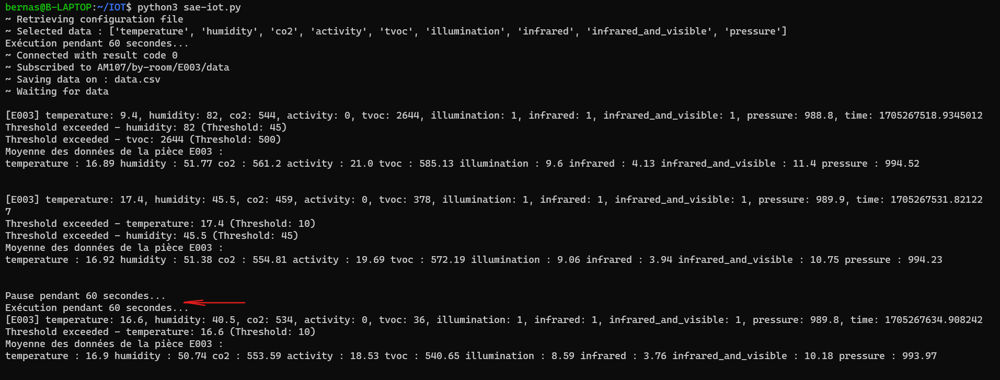

Nous pouvons voir sur l'image ci-dessus que l'application a bien effeccuté les écoutes avec une pause de 60 secondes.

== Conclusion
Notre application python permet de récupérer les données envoyées par les différents capteurs présents dans les entrepôts de stockage de MalyArt qui les utilise pour s'assurer que les conditions de stockage sont optimales pour les oeuves d'art qui y sont entreposées.
