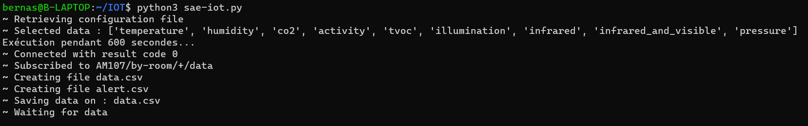
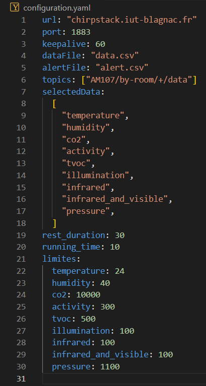

= SAÉ 3.01 2023-2024 - Documentation Python - Équipe 5
:toc:
:toc-title: Table des matières
:sectnums: 
:sectnumlevels: 4

== Introduction
Notre application python permet de récupérer les données envoyées par les différents capteurs présents dans les entrepôts de stockage de MalyArt qui les utilise pour s'assurer que les conditions de stockage sont optimales pour les oeuves d'art qui y sont entreposées.

L'objectif est de pouvoir afficher ces données sur une application JavaFX pour que les employés de MalyArt puissent les consulter facilement.  

== Prérequis

L'application nécessite plusieurs choses qu'il vous faudra installer au préalable : 

- `Python 3` ou une version ultérieure. (https://www.python.org/downloads/)
- `pip` pour installer les dépendances. (Inclus dans Python 3.4 et supérieur) 
- `csv` pour lire les fichiers csv. (Bibliothèque Python)
- `yaml` pour lire les fichiers yaml. (`pip install pyyaml`	)
- `paho.mqtt.client` pour communiquer avec le broker MQTT. (`pip install paho-mqtt`)
- `json` pour lire les fichiers json. (Bibliothèque Python)
- `time` pour gérer le temps. (Bibliothèque Python)
- `signal` pour gérer les signaux. (Bibliothèque Python)

== Installation
1. Téléchargez le fichier python à partir du lien suivant : https://github.com/IUT-Blagnac/sae-3-01-devapp-Equipe-5/blob/IOT/IOT/PYTHON/sae-iot.py[sae-iot.py]

2. Téléchargez le fichier de configuration à partir du lien suivant : https://github.com/IUT-Blagnac/sae-3-01-devapp-Equipe-5/blob/IOT/IOT/PYTHON/configuration.yaml[configuration.yaml]

3. Regroupez les deux fichiers dans un même dossier.

image::./img/files.png[Image montant le dossier contenant les deux fichiers]

== Utilisation
Pour utiliser l'application, il vous suffit de lancer le fichier python comme ceci :
//image of the command line
[source,shell]
----
python3 sae-iot.py
----

image::./img/launch.png[Image montrant la commande de lancement de l'application]

L'application va alors se connecter au broker MQTT et récupérer les données des capteurs. Elle va ensuite les enregistrer dans un fichier csv et les afficher dans la console.

== Configuration

Pour configurer l'application, il vous suffit de modifier le fichier de configuration.

=== Configuration du broker MQTT
Pour configurer le broker MQTT, il vous suffit de modifier les valeurs des champs `url`, `port` et `keepalive`.

=== Configuration des topics
Pour configurer les topics, il vous suffit de modifier la valeur du champ `topics`.
Chaque topic doit être séparé par une virgule.

=== Configuration des fichiers de données
Pour configurer les fichiers de données, il vous suffit de modifier les valeurs des champs `dataFile` et `alertFile`.

WARNING: Les fichiers doivent être au format csv!

=== Configuration des capteurs
Pour configurer les capteurs, il vous suffit de modifier la valeur du champ `selectedData`.
Chaque capteur doit être séparé par une virgule.

=== Configuration des fréquences de récupération des données
Pour configurer les fréquences de récupération des données, il vous suffit de modifier les valeurs des champs `rest_duration` et `running_time`.

`rest_duration` correspond à la durée de pause entre chaque récupération de données.
`running_time` correspond à la durée de récupération des données. 

=== Configuration des limites
Pour configurer les limites, il vous suffit de modifier les valeurs des champs `limites`.

== Fonctionnement
Notre application python fonctionne de la manière suivante :

=== Récupération des paramètres
L'application récupère les paramètres du fichier de configuration.

image::./img/read_config.png[Image montrant le fichier de configuration]

=== Connexion au broker MQTT
L'application se connecte au broker MQTT.
Cela se fait grâce à la fonction `on_connect` qui est appelée lorsque l'application se connecte au broker MQTT.

Dans la même fonction, l'application s'abonne aux topics configurés dans le fichier de configuration.

image::./img/connect.png[Image montrant la connexion au broker MQTT]

=== Création des fichiers de données
Dans la fonction `on_connect`, l'application crée les fichiers de données configurés dans le fichier de configuration s'ils n'existent pas déjà.

image::./img/create_files.png[Image montrant la création des fichiers de données]

=== Récupération des données
L'application reçoit les données des capteurs grâce à la fonction `on_message` qui est appelée lorsque l'application reçoit un message du broker MQTT.

Dans un premier temps, l'application récupère les données du message et les transforme en dictionnaire json.
Puis elle ne retient que les données des capteurs configurés dans le fichier de configuration. Cela se faite grâce à un dictionnaire crée en compréhension qui ne retient que les données des capteurs configurés.

image::./img/get_data.png[Image montrant la récupération des données]

=== Enregistrement des données
L'application enregistre ensuite les données dans le fichier de données configuré dans le fichier de configuration.

image::./img/save_data.png[Image montrant l'enregistrement des données]

=== Check et enregistrement des alertes
L'application vérifie ensuite si les données reçues sont en dehors des limites configurées dans le fichier de configuration.
Si c'est le cas, elle enregistre une alerte dans le fichier d'alertes.

image::./img/check_alert.png[Image montrant le check et l'enregistrement des alertes]

=== Moyenne des données
L'application calcule ensuite la moyenne des données reçues et l'affiche dans la console.

image::./img/average.png[Image montrant le calcul de la moyenne des données]

Cette moyenne est calculée en ouvrant le fichier de données, en lisant les données et en calculant la moyenne de chaque type de données pour la pièce. 

=== Fréquence de récupération des données
L'application attend ensuite la durée de pause configurée dans le fichier de configuration avant de récupérer de nouveau les données. Pour cela, nous utilisons la librairie `signal` qui permet de gérer les signaux.

image::./img/wait.png[Image montrant l'attente de la durée de pause]

Le fonctionnement est le suivant :

- L'application crée un signal `SIGALRM` qui est appelé lorsque la durée de pause est écoulée, ce signal appelle la fonction `handler`.
- Lors de l'appel de la fonction `handler` (ici `handle_execution`), celle-ci débute l'écoute des données du broker MQTT tant que la durée de récupération des données n'est pas écoulée.
- Lorsque la durée de récupération des données est écoulée, la fonction `handle_execution` lance une nouvelle alarme qui débute le temps de pause.
- Pour l'attente de l'alarme nous avons une boucle infinie qui attend la réception du signal `SIGALRM`.

== Exemple d'utilisation

Pour tester notre application, nous avons utilisé le broker MQTT `chirpstack.iut-blagnac.fr` et le topic `AM107/by-room/+/data`.

image::./img/example.png[Image montrant un exemple d'utilisation de l'application]

L'application récupère les données du capteur `AM107` et les enregistre dans le fichier `data.csv` et les alertes dans le fichier `alert.csv`.

image::./img/example_files.png[Image montrant les fichiers de données et d'alertes]

== Conclusion
Notre application python permet de récupérer les données envoyées par les différents capteurs présents dans les entrepôts de stockage de MalyArt qui les utilise pour s'assurer que les conditions de stockage sont optimales pour les oeuves d'art qui y sont entreposées.

