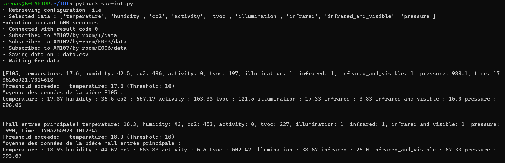

= SAÉ 3.01 2023-2024 - Documentation Python - Équipe 5
:toc:
:toc-title: Table des matières
:sectnums: 
:sectnumlevels: 4

== Introduction
Notre application python permet de récupérer les données envoyées par les différents capteurs présents dans les entrepôts de stockage de MalyArt qui les utilise pour s'assurer que les conditions de stockage sont optimales pour les oeuves d'art qui y sont entreposées.

L'objectif est de pouvoir afficher ces données sur une application JavaFX pour que les employés de MalyArt puissent les consulter facilement.  

== Prérequis

L'application nécessite plusieurs choses qu'il vous faudra installer au préalable : 

- `Python 3` ou une version ultérieure. (https://www.python.org/downloads/)
- `pip` pour installer les dépendances. (Inclus dans Python 3.4 et supérieur) 
- `csv` pour lire les fichiers csv. (Bibliothèque Python)
- `yaml` pour lire les fichiers yaml. (`pip install pyyaml`	)
- `paho.mqtt.client` pour communiquer avec le broker MQTT. (`pip install paho-mqtt`)
- `json` pour lire les fichiers json. (Bibliothèque Python)
- `time` pour gérer le temps. (Bibliothèque Python)
- `signal` pour gérer les signaux. (Bibliothèque Python)

WARNING: L'application ne fonctionne que sur *Linux*.

== Installation
1. Téléchargez le fichier python à partir du lien suivant : https://github.com/IUT-Blagnac/sae-3-01-devapp-Equipe-5/blob/IOT/IOT/PYTHON/sae-iot.py[sae-iot.py]

2. Téléchargez le fichier de configuration à partir du lien suivant : https://github.com/IUT-Blagnac/sae-3-01-devapp-Equipe-5/blob/IOT/IOT/PYTHON/configuration.yaml[configuration.yaml]

3. Regroupez les deux fichiers dans un même dossier.

image::./img/files.png[Image montant le dossier contenant les deux fichiers]

WARNING: Il est important que les noms des fichiers soient respectés.

== Utilisation
Pour utiliser l'application, il vous suffit d'ouvrir un terminal dans le dossier contenant les deux fichiers et de lancer la commande suivante :

[source,shell]
----
python3 sae-iot.py
----

image::./img/launch.png[Image montrant la commande de lancement de l'application]

== Exemple d'utilisation
Lorsque l'application est lancée, elle va alors se connecter au broker MQTT et s'abonner aux topics configurés dans le fichier de configuration. Elle va ensuite afficher les données reçues dans la console et les enregistrer dans un fichier csv.

== Explication de la structure du code
Le programme python est divisé en deux parties :
- Le fichier de configuration (configuration.yaml)
- Le fichier principal (sae-iot.py)

=== Le fichier de configuration
Le fichier de configuration est un fichier yaml qui permet de configurer l'application. Il est divisé en plusieurs parties :

==== Le broker
Cette partie permet de configurer le broker MQTT. Il est possible de modifier l'adresse du broker et le port utilisé.

[source,yaml]
----
url: "chirpstack.iut-blagnac.fr"
port: 1883
keepalive: 60
----

==== Les topics
Cette partie permet de configurer les topics MQTT. Il est possible de modifier les topics auxquels l'application va s'abonner.

[source,yaml]
----
topics: ["AM107/by-room/+/data","AM107/by-room/E003/data","AM107/by-room/E006/data"]
----

==== Les fichiers
Cette partie permet de configurer les fichiers csv ou se trouvent les données des capteurs. Il est possible de modifier les fichiers csv utilisés par l'application.

[source,yaml]
----
dataFile: "data.csv"
alertFile: "alert.csv"
----

==== Les données des capteurs à récupérer
Cette partie permet de configurer les données des capteurs à récupérer. Il est possible de modifier les données des capteurs à récupérer.

[source,yaml]
----
selectedData: ["temperature","humidity","co2","activity","tvoc","illumination","infrared","infrared_and_visible","pressure"]
----

==== Les temps d'attente entre chaque écoute 
Cette partie permet de configurer les temps d'attente entre chaque écoute. Il est possible de modifier les temps d'attente entre chaque écoute. (Le temps ou l'application va ecouter les données des capteurs est aussi présent mais il n'est pas possible de le modifier dans l'application)

[source,yaml]
----
rest_duration  : 30
running_time : 10
----

==== Les seuils d'alertes
Cette partie permet de configurer les seuils d'alertes. Il est possible de modifier les seuils d'alertes.

[source,yaml]
----
thresholds:
  temperature : 10
  humidity : 45
  co2 : 10000
  activity : 300
  tvoc : 500
  illumination : 100
  infrared : 100
  infrared_and_visible : 100
  pressure : 1100
----

=== Le fichier principal
Le fichier principal est le fichier python qui permet de récupérer les données des capteurs s'organise autour d'une fonction principale qui est la fonction `on_message(client, userdata, msg)`.

Cette fonction est appelée à chaque fois que l'application reçoit un message du broker MQTT. Celle-ci va alors recupérer les données json du message, les convertir en dictionnaire python et les enregistrer dans un fichier csv puis les afficher dans la console.

La fonction va ensuite vérifier si les données reçues sont supérieures aux seuils d'alertes. Si c'est le cas, elle va enregistrer les données dans un fichier csv d'alerte.

Pour finir la fonction va afficher la moyenne des données reçues pour la pièce dans la console.

En plus de la fonction principale, le fichier python contient aussi une fonction `on_connect(client, userdata, flags, rc)` qui est appelée à chaque fois que l'application se connecte au broker MQTT. Celle-ci va alors s'abonner aux topics configurés dans le fichier de configuration et créer les fichiers csv si ils n'existent pas.

Nous avons également une partie qui permet de gérer les temps d'attente entre chaque écoute à l'aide de la fonction `signal.signal(signal.SIGALRM, handler)` qui permet de gérer les signaux et de la fonction `handle_execution(signum, frame)` qui permet de gérer les signaux reçus par l'application. +
Nous utilisons les alarmes pour gérer les temps d'attente entre chaque écoute. Lorsque l'application reçoit un signal, elle va alors se mettre en pause pendant le temps d'attente configuré dans le fichier de configuration puis elle va reprendre son écoute.

Au début du programme, nous avons une partie qui permet de lire le fichier de configuration et de le convertir en dictionnaire python.

L'application tourne en boucle jusqu'à ce que l'utilisateur appuie sur `CTRL+C` pour l'arrêter. Lorsque l'application est arrêtée, elle va alors se désabonner des topics et se déconnecter du broker MQTT.

== Tests
Nous allons maintenant tester l'application en utilisant le broker MQTT de l'IUT de Blagnac. 
Pour cela, nous allons utiliser le topic `AM107/by-room/E003/data` qui contient les données du capteur de la salle E003.

=== Test 1 : Lancement de l'application et réception des données normales
Pour ce premier test, nous allons lancer l'application et vérifier que celle-ci reçoit bien les données du capteur de la salle E003.

image::./img/test1.png[Image montrant le lancement de l'application et la réception des données du capteur de la salle E003]

Comme nous pouvons le voir sur l'image ci-dessus, l'application a bien reçu les données du capteur de la salle E003 et les a affichées dans la console.

image::./img/test1csv.png[Image montrant les données du capteur de la salle E003 dans le fichier csv]

Nous pouvons également voir que les données ont bien été enregistrées dans le fichier csv.

=== Test 2 : Réception des données d'alertes

Pour ce deuxième test, nous allons modifier les seuils d'alertes dans le fichier de configuration pour que l'application reçoive des données d'alertes.

image::./img/test2.png[Image montrant le lancement de l'application et la réception des données d'alertes du capteur de la salle E003]

Comme nous pouvons le voir sur l'image ci-dessus, l'application a bien reçu les données d'alertes du capteur de la salle E003 et les a affichées dans la console et en plus nous avons des données d'alertes affichées dans le terminal et dans le fichier csv d'alertes.

image::./img/test2csv.png[Image montrant les données d'alertes du capteur de la salle E003 dans le fichier csv d'alertes]

=== Test 3 : Réception des données anormales
Pour le troisième test, nous allons modifier le message reçu par l'application pour que celle-ci reçoive des données anormales.

image::./img/test3.png[Image montrant le lancement de l'application et la réception des données anormales du capteur de la salle E003]

Nous pouvons voir sur l'image ci-dessus que l'application a signalé que les données reçues étaient anormales.

=== Test 4 : Temps d'attente
Pour le quatrième test, nous allons modifier le temps d'attente entre chaque écoute pour que le temps d'attente soit reduit.

image::./img/test4.png[Image montrant le lancement de l'application et la réception des données du capteur de la salle E003 avec un temps d'attente réduit]

Nous pouvons voir sur l'image ci-dessus que l'application a bien effeccuté les écoutes avec une pause de 60 secondes.